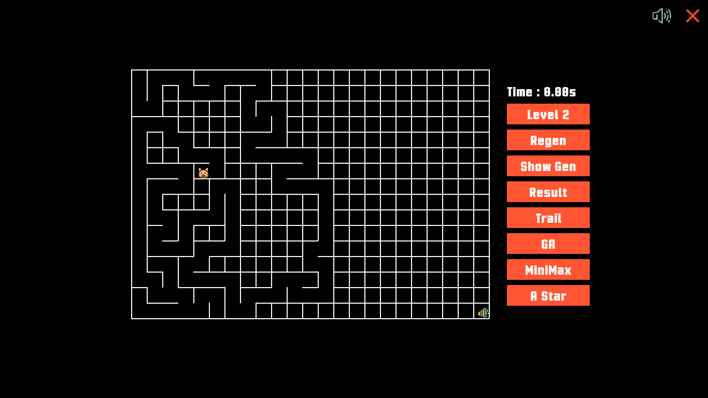

# Maze Solver Game with AI Algorithms

## Overview
This project is a maze-solving game that incorporates various Artificial Intelligence (AI) algorithms to find the optimal path. It features both manual gameplay and automated AI solutions using:
- **A* Search**
- **Minimax Algorithm with Alpha-Beta Pruning**
- **Genetic Algorithm**
- **Fuzzy Logic for Scoring**

## Features
- **Maze Generation**: The maze is created using the Depth-First Search (DFS) algorithm.
- **AI Solvers**: The game implements multiple AI techniques for solving the maze efficiently.
- **Manual Play**: Users can manually navigate through the maze and receive a fuzzy logic-based score.
- **Graphical User Interface (GUI)**: A user-friendly interface for playing the game and visualizing AI solutions.

## Screenshots
| Game Interface | AI Solution Visualization |
|---------------|-------------------------|
|  |  |

## Algorithms Used
### 1. A* Search
A* Search finds the shortest path using a cost function:
\[ f(n) = g(n) + h(n) \]
where:
- **g(n)**: Cost from start node to current node.
- **h(n)**: Heuristic estimate to the goal.

### 2. Genetic Algorithm
- Generates random solutions (chromosomes).
- Uses selection, crossover, and mutation to evolve the best path.

### 3. Minimax with Alpha-Beta Pruning
- The minimax algorithm is used for decision-making.
- Alpha-beta pruning optimizes performance by cutting off unnecessary branches.

### 4. Fuzzy Logic
- Used for scoring manual gameplay.
- Determines performance levels based on blocks accessed and time elapsed.

## Contributors
- **[Samin Saiara]** - A* Search, Alpha-Beta Pruning, Maze Creation
- **[Sumiya Islam Barsha]** - Genetic Algorithm, Fuzzy Logic, Agent Handling

